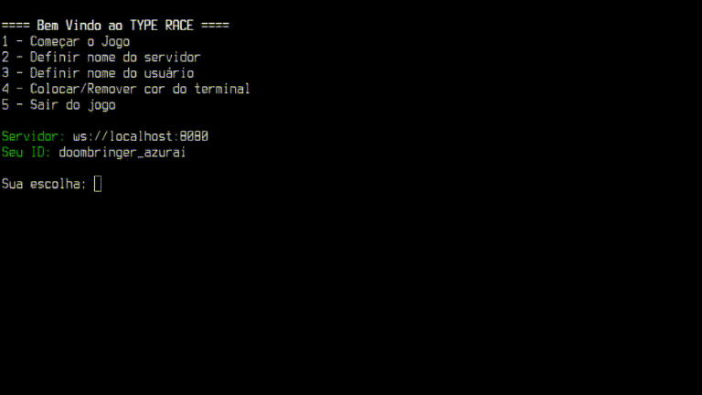

## redes-ep2-typerace
Repositório para o EP2 de Redes de Computadores, EACH-USP - 2021/2

### Integrantes
* Guilherme Kendji Ishikawa - 11914650
* Gustavo Pimentel Soares   - 11795961
* Gustavo Tsuyoshi Ariga    - 11857215
* Henrique Tsuyoshi Yara    - 11796083

### Pré-requisitos
* JDK 11 ou maior (testado com a JDK11 OpenJDK)
* Gradle (incluso no repositório, não é necessário instalá-lo)

### Rodando
Para rodar o servidor na porta padrão:
```sh
./gradlew server:run
```

Para rodar o servidor em alguma porta específica:
```sh
./gradlew server:run --args='123'
```
Para rodar o jogo:
```sh
./gradlew client:run
```

Para ter uma melhor experiência ao jogar o jogo recomendamos rodar :D :
```sh
./gradlew client:run --console=plain
```

### Preview



### Lista de palavras

A lista de palavras é feito usando como base uma lista com as palavras do roteiro do filme Shrek 2 com palavras únicas e acima de 3 caracteres

### Códigos de resposta

Os códigos de resposta usados no trabalho foram baseados [nesse repositório](https://github.com/Luka967/websocket-close-codes)
